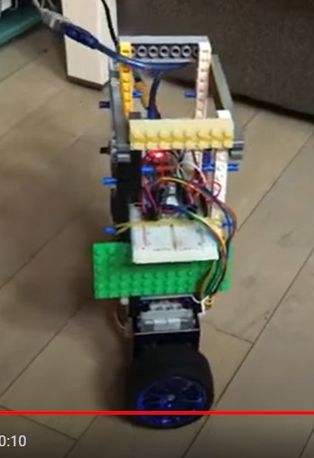

# dwr (Differential Wheeled Robot)

A project to build a robot with two wheels.

# proto1

The simplest design - two wheels and one caster ball.

* 2 geared DC motors with encoder
* Arduino Uno

# proto2

Balancing on two wheels driven by stepper motors.

* 2 nema 17 stepper motors
* Arduino nano
* MPU6050

# proto3

* ESP32

