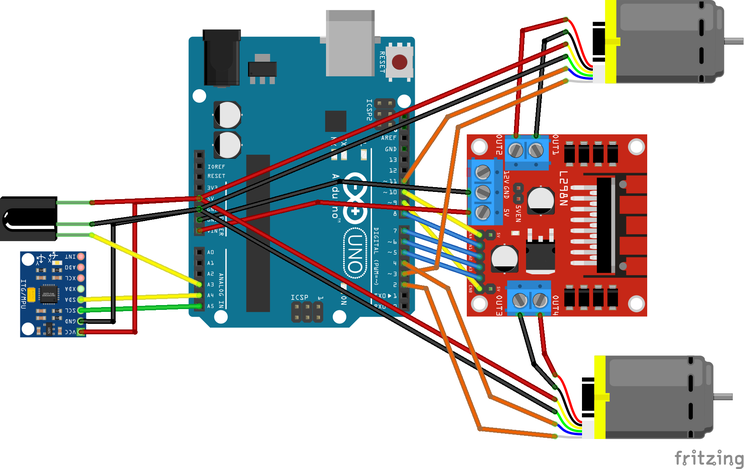

# proto1

The simplest design - two differential wheels and a ball caster as the third wheel

Press the picture to see the video on YouTube.

[](https://youtu.be/fgpBi1nglc4)

# Hardware 

* 2 geared DC motors with encoder
* 2 wheels, 84mm in diameter
* L293N motor driver
* Arduino Uno
* MPU6050
* IR receiver
* Xiaomi Power Bank 10400mAh



# Software

* sketch/ - main source code
* test/ - codes to test the hardware parts.
* fritzing/ - fritzing files of the hardware

## Required Library

* IRremote
* I2Cdev, MPU6050 from https://github.com/jrowberg/i2cdevlib

You can use Arduino standard IDE to compile the source code and upload. But I prefer to use linux terminal.

```bash
$ arduino-cli lib install IRremote
$ git clone https://github.com/jrowberg/i2cdevlib
$ cd i2cdevlib/Arduino/
$ cp -r I2Cdev/ MPU6050/ ~/Arduino/libraries/
```
## compile & upload

### Arduino Uno board

```bash
$ cd dwr/proto1
$ arduino-cli compile --fqbn arduino:avr:uno -u -p /dev/ttyACM0 sketch/
$ stty -F /dev/ttyACM0 cs8 115200 ignbrk -brkint -icrnl -imaxbel -opost -onlcr -isig -icanon -iexten -echo -echoe -echok -echoctl -echoke noflsh -ixon -crtscts
$ cat /dev/ttyACM0
```

### Arduino Uno clone

```bash
$ cd dwr/proto1
$ arduino-cli compile --fqbn arduino:avr:uno -u -p /dev/ttyUSB0 sketch/
$ stty -F /dev/ttyUSB0 cs8 115200 ignbrk -brkint -icrnl -imaxbel -opost -onlcr -isig -icanon -iexten -echo -echoe -echok -echoctl -echoke noflsh -ixon -crtscts
$ cat /dev/ttyUSB0
```

### Arduino Nano clone
```bash
$ cd dwr/proto1
$ arduino-cli compile --fqbn arduino:avr:nano:cpu=atmega328old -u -p /dev/ttyUSB0 sketch/
$ stty -F /dev/ttyUSB0 cs8 115200 ignbrk -brkint -icrnl -imaxbel -opost -onlcr -isig -icanon -iexten -echo -echoe -echok -echoctl -echoke noflsh -ixon -crtscts
$ cat /dev/ttyUSB0
```

