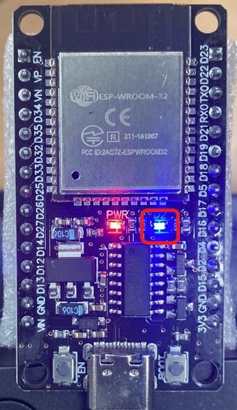

# Test LED blinking and measure the delay of the Serial.print().

The built-in LED turns on and off and test strings and results are printed out through serial port every 1 second repeatedly.



```
115200, i = 60
1
	Serial.print(1 character): 18 usec
1234567890
	Serial.print(10 characters): 18 usec
123456789012
	Serial.print(12 characters): 19 usec
1234567890
	Serial.println(10 characters): 35 usec
1234567890123456789012345678901234567890
	Serial.print(40 characters): 21 usec
1234567890123456789012345678901234567890
	Serial.println(40 characters): 46 usec
1234567890123456789012345678901234567890
1234567890123456789012345678901234567890
	Serial.println(40 characters) x 2: 76 usec
12345678901234567890123456789012345678901234567890123456789012345678901234567890
	Serial.print(80 characters): 25 usec
12345678901234567890123456789012345678901234567890123456789012345678901234567890
	Serial.println(80 characters): 42 usec
12345678901234567890123456789012345678901234567890123456789012345678901234567890
12345678901234567890123456789012345678901234567890123456789012345678901234567890
	Serial.println(80 characters) x 2: 10299 usec
123456789012345678901234567890123456789012345678901234567890123456789012345678901234567890
	Serial.print(90 characters): 10241 usec
1234567890123456789012345678901234567890123456789012345678901234567890123456789012345678901234567890
	Serial.print(100 characters): 27 usec
12345678901234567890123456789012345678901234567890123456789012345678901234567890123456789012345678901234567890
	Serial.print(110 characters): 10191 usec
123456789012345678901234567890123456789012345678901234567890123456789012345678901234567890123456789012345678901234567890
	Serial.print(120 characters): 10252 usec
123456789012345678901234567890123456789012345678901234567890123456789012345678901234567890123456789012345678901234567890
	Serial.println(120 characters): 10253 usec
```

It shows the delay of serial print, which is different from Arduino. It is not proportional to the number of characters. The delay suddenly goes up from microseconds to milliseconds when the number of characters is bigger than 90. But the print of 100 characters takes only 27 usec, which is weird. I guess that it's due to the buffer mechanism for serial output, which I don't know exactly.

But one thing is clear - I can print out 80 characters with delay of only a few tens of microseconds, but only when I print it not repeatedly. 

