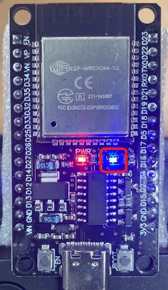

# Test LED blinking and measure the delay of the printf().

The built-in LED turns on and off and test strings and results are printed out through serial port every 1 second repeatedly.



The code was mainly taken from https://github.com/espressif/esp-idf/tree/master/examples/get-started/blink.

## Build and Run

Change `COM4` or `/dev/cu.usbserial-1130` according to your environment.

Windows: open ESP-IDF shell (CMD or PowerShell), change to the source directory, and then:

```
idf.py set-target esp32
idf.py build
idf.py -p COM4 flash monitor
```

MacOS: open a shell, change to the source directory, and then:

```
source ~/esp/esp-idf/export.sh
idf.py set-target esp32
idf.py build
idf.py -p /dev/cu.usbserial-1130 flash monitor
```

## Result

```
7.757190: ON
1234567890
 10 characters: 53 usec
1234567890123456789012345678901234567890
 40 characters: 51 usec
123456789012345678901234567890123456789012345678901234567890123456789012345678901234567890123456789012345678901234567890
 120 characters: 65 usec
1234567890123456789012345678901234567890123456789012345678901234567890123456789012345678901234567890123456789012345678901234567890123456789012345678901234567890
 160 characters: 11111 usec
1234567890123456789012345678901234567890123456789012345678901234567890123456789012345678901234567890123456789012345678901234567890123456789012345678901234567890123456789012345678901234567890123456789012345678901234567890123456789012345678901234567890
 250 characters: 11117 usec
```

It shows the delay of serial print, which is different from Arduino CLI. It is not proportional to the number of characters. The delay suddenly goes up from microseconds to milliseconds when the number of characters is bigger than 160.

One thing is clear - I can print out 120 characters with delay of only a few tens of microseconds, but only when I print it not repeatedly. 

